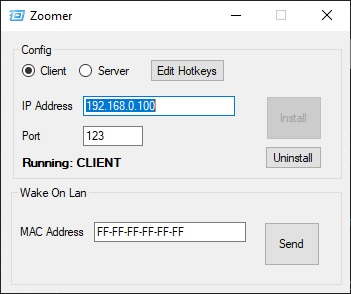
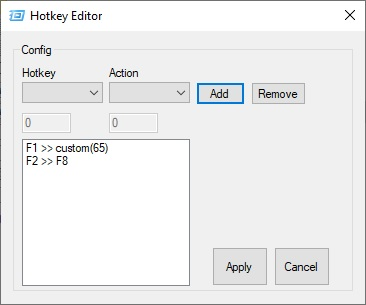

# Zoomer
Windows app that transmits hotkey presses between Client/Server PCs, with additional WakeOnLan module.

 
## Instructions:
1. Run-As-Admin Zoomer.exe on the 'Server' computer that you would like 'Action' key presses to be executed on.
   - Select the 'Server' radio button.
   - Specify a port (NOTE: Highly recommend using ports from the range 49152 to 65535).
   - Press 'Install' to save configuration and run.
2. *(Optional)* If you will be communicating over the internet, make sure to setup Port Forwarding on your router (on the server-side).
   - **WARNING:** Do this at your own risk, there is no security/authentication in this program and it could be a possible vulnerability if exposed to the internet, especially if using a well-known port.
   - Uses UDP Protocol.
3. Run Zoomer.exe on the 'Client' computer that will use 'Hotkeys' to execute an 'Action' on the 'Server'.
   - Select the 'Client' radio button.
   - Specify IP Address & Port of the 'Server'
   - Press 'Install' to save configuration and run.
4. After Installing if you change the configuration or hotkeys, be sure to press the 'Update' button to update the running configuration.

**NOTE:** To use custom hotkeys, see: https://docs.microsoft.com/en-us/windows/win32/inputdev/virtual-key-codes
Be sure to use the integer value of the values listed on this webpage (Example: 0x41 is the binary hex value for the 'a' key, which converts to an integer value of 65)
